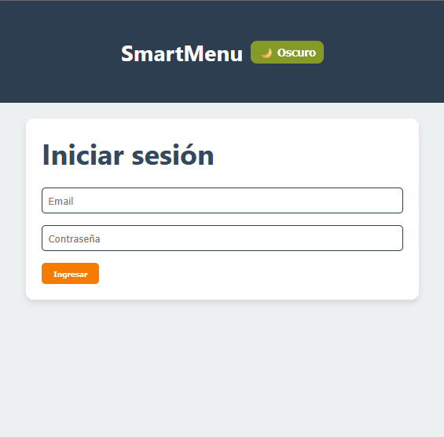
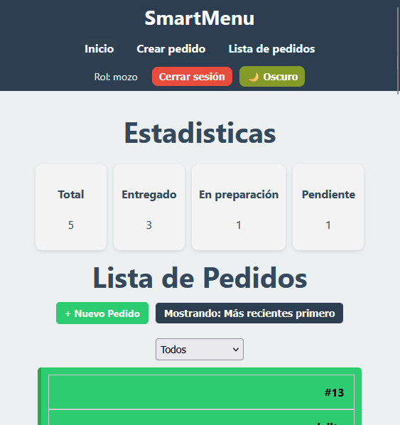
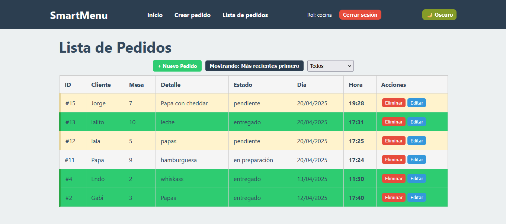

# 🍽️ SmartMenu
## Sistema de Gestión de Pedidos

Una aplicación web para gestionar pedidos en un restaurante, con roles diferenciados, filtros, estadísticas y modo oscuro. Hecha con ❤️ usando React, Express y SQLite.

    
    
    

    

## 🛠️ Tecnologías

## 🚀 Funcionalidades
- 🔐 Login persistente con `LocalStorage`
- 🔒 Rutas protegidas según rol (`mozo`, `cocina`)
- ✏️ Crear, editar y eliminar pedidos
- 🎯 Filtros por estado: `pendiente`, `en preparación`, `entregado`
- 🕒 Ordenar pedidos por fecha de creación
- 📊 Estadísticas en tiempo real de pedidos por estado
- 🌓 Modo oscuro / claro
- 🧾 Vista exclusiva para cocina en modo solo-lectura
- 🛠️ Administración de usuarios y roles *(en desarrollo)*

## 🧑‍💻 Roles
- 👨‍🍽️ **Mozo**
  - Acceso completo a los pedidos
  - Puede **crear**, **editar**, **eliminar** pedidos ➕✏️🗑️
  - Visualiza **estadísticas globales**

- 👩‍🍳 **Cocina**
  - Puede **ver** pedidos
  - Cambiar el estado a **"en preparación"** o **"entregado"**

Creado con 💖 por GGabi40.
